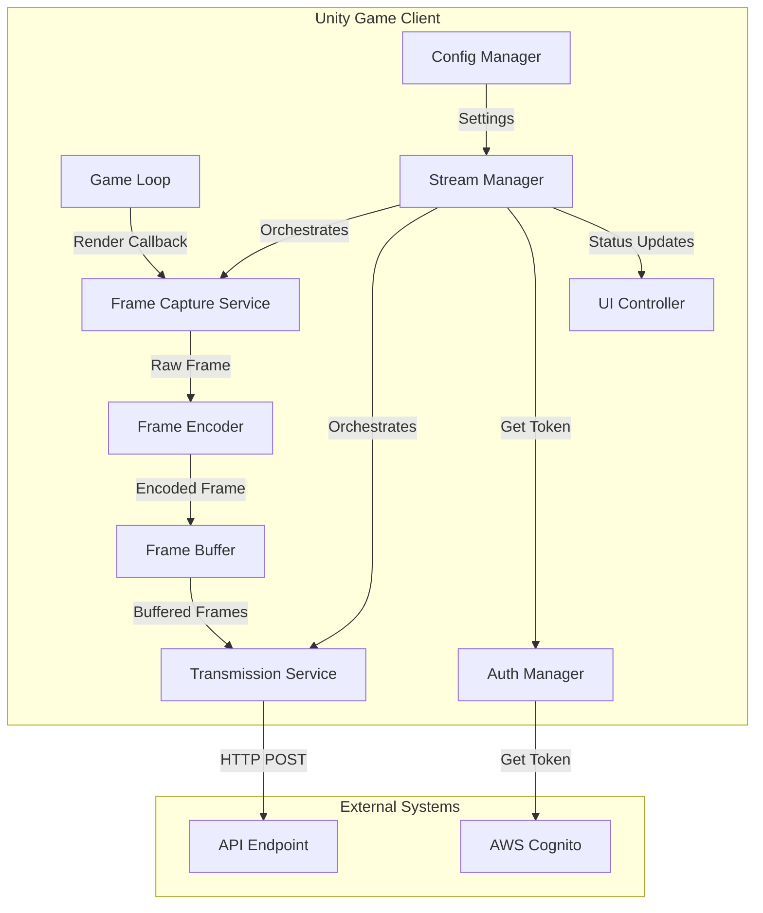
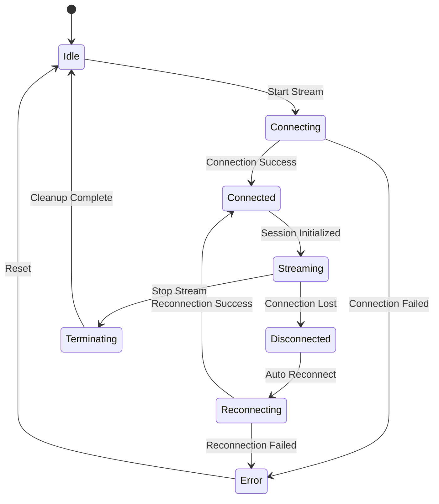

# Design Document: Game Live Streaming

## Overview

This design implements a live streaming system for a Unity tower defense game that captures gameplay frames and transmits them to a self-hosted API endpoint. The system is designed to operate asynchronously to maintain game performance while providing reliable stream delivery with automatic reconnection and buffering capabilities.

### Key Design Goals

- Maintain game performance above 30 FPS during streaming
- Provide reliable stream delivery with automatic recovery from network interruptions
- Minimize resource usage (CPU, memory, bandwidth)
- Integrate seamlessly with existing AWS authentication system
- Support configurable quality and performance settings

### Technology Stack

- **Unity Engine**: Game client platform
- **C#**: Primary implementation language
- **UnityWebRequest**: HTTP communication with API endpoint
- **Unity Coroutines**: Asynchronous frame capture and transmission
- **System.Threading.Tasks**: Background processing for encoding
- **AWS SDK for .NET**: Authentication token management
- **JSON.NET (Newtonsoft.Json)**: JSON serialization
- **Unity RenderTexture**: Frame capture mechanism

## Architecture

### High-Level Architecture

The streaming system follows a producer-consumer pattern with three main layers:

1. **Capture Layer**: Captures gameplay frames from Unity's rendering pipeline
2. **Processing Layer**: Encodes, compresses, and buffers frames
3. **Transmission Layer**: Sends frames to the API endpoint with retry logic



### Component Responsibilities

**StreamManager**
- Orchestrates the entire streaming lifecycle
- Manages connection state transitions
- Coordinates frame capture, encoding, and transmission
- Handles reconnection logic
- Monitors resource usage and adjusts settings

**FrameCaptureService**
- Captures frames from Unity's rendering pipeline using RenderTexture
- Extracts game state metadata (wave, towers, enemies, health, score)
- Timestamps frames with UTC time
- Operates at configurable frame rate

**FrameEncoder**
- Compresses frame data using Unity's ImageConversion
- Encodes visual data as base64 strings
- Serializes frame metadata to JSON
- Assigns sequence numbers to frames
- Runs on background thread to avoid blocking game loop

**FrameBuffer**
- Maintains a circular buffer of encoded frames
- Implements size limits (30 seconds of frames, 100 MB max)
- Provides thread-safe enqueue/dequeue operations
- Automatically drops oldest frames when buffer is full

**TransmissionService**
- Sends frames to API endpoint via HTTP POST
- Implements retry logic with exponential backoff
- Monitors transmission success/failure rates
- Handles connection interruptions
- Operates asynchronously using Unity coroutines

**AuthManager**
- Retrieves authentication tokens from AWS Cognito
- Refreshes expired tokens automatically
- Provides tokens to TransmissionService
- Handles authentication failures

**ConfigManager**
- Persists streaming configuration using PlayerPrefs
- Validates configuration values
- Provides configuration to StreamManager
- Supports runtime configuration changes

**UIController**
- Displays streaming status indicator
- Shows connection state, frame rate, session duration
- Displays error notifications
- Provides configuration interface

### State Management

The StreamManager maintains the following states:



## Components and Interfaces

### StreamManager

```csharp
public class StreamManager : MonoBehaviour
{
    // Public API
    public void StartStreaming();
    public void StopStreaming();
    public ConnectionState GetConnectionState();
    public StreamingStats GetStats();
    
    // Configuration
    public void UpdateConfiguration(StreamingConfig config);
    
    // Events
    public event Action<ConnectionState> OnConnectionStateChanged;
    public event Action<string> OnError;
    public event Action<StreamingStats> OnStatsUpdated;
}

public enum ConnectionState
{
    Idle,
    Connecting,
    Connected,
    Streaming,
    Disconnected,
    Reconnecting,
    Terminating,
    Error
}

public class StreamingStats
{
    public float CurrentFrameRate { get; set; }
    public TimeSpan SessionDuration { get; set; }
    public int FramesSent { get; set; }
    public int FramesDropped { get; set; }
    public float MemoryUsageMB { get; set; }
    public float CpuUsagePercent { get; set; }
}
```

### FrameCaptureService

```csharp
public class FrameCaptureService
{
    public GameplayFrame CaptureFrame();
    public void SetFrameRate(int fps);
    public void SetQuality(QualityLevel quality);
}

public class GameplayFrame
{
    public long SequenceNumber { get; set; }
    public DateTime Timestamp { get; set; }
    public byte[] VisualData { get; set; }
    public GameStateMetadata Metadata { get; set; }
}

public class GameStateMetadata
{
    public int CurrentWave { get; set; }
    public int TowerCount { get; set; }
    public int EnemyCount { get; set; }
    public int PlayerHealth { get; set; }
    public int Score { get; set; }
}

public enum QualityLevel
{
    Low,      // 640x360
    Medium,   // 1280x720
    High      // 1920x1080
}
```

### FrameEncoder

```csharp
public class FrameEncoder
{
    public Task<EncodedFrame> EncodeAsync(GameplayFrame frame);
    public void SetCompressionQuality(int quality); // 0-100
}

public class EncodedFrame
{
    public long SequenceNumber { get; set; }
    public string Timestamp { get; set; }
    public string VisualDataBase64 { get; set; }
    public GameStateMetadata Metadata { get; set; }
    public int FormatVersion { get; set; }
    public int SizeBytes { get; set; }
}
```

### FrameBuffer

```csharp
public class FrameBuffer
{
    public void Enqueue(EncodedFrame frame);
    public EncodedFrame Dequeue();
    public bool TryDequeue(out EncodedFrame frame);
    public int Count { get; }
    public float MemoryUsageMB { get; }
    public void Clear();
}
```

### TransmissionService

```csharp
public class TransmissionService
{
    public Task<TransmissionResult> SendFrameAsync(EncodedFrame frame, string authToken);
    public Task<bool> SendSessionInitAsync(SessionInitMessage message, string authToken);
    public Task<bool> SendSessionTerminateAsync(SessionTerminateMessage message, string authToken);
    public void SetEndpoint(string url);
}

public class TransmissionResult
{
    public bool Success { get; set; }
    public int StatusCode { get; set; }
    public string ErrorMessage { get; set; }
    public int RetryCount { get; set; }
}

public class SessionInitMessage
{
    public string PlayerId { get; set; }
    public string GameVersion { get; set; }
    public DateTime SessionStartTime { get; set; }
    public StreamingConfig Config { get; set; }
}

public class SessionTerminateMessage
{
    public string SessionId { get; set; }
    public DateTime SessionEndTime { get; set; }
    public StreamingStats FinalStats { get; set; }
}
```

### AuthManager

```csharp
public class AuthManager
{
    public Task<string> GetAuthTokenAsync();
    public Task<bool> RefreshTokenAsync();
    public bool IsTokenValid();
}
```

### ConfigManager

```csharp
public class ConfigManager
{
    public StreamingConfig LoadConfig();
    public void SaveConfig(StreamingConfig config);
    public bool ValidateConfig(StreamingConfig config);
}

public class StreamingConfig
{
    public string ApiEndpointUrl { get; set; }
    public int FrameRate { get; set; } // 1-30
    public QualityLevel Quality { get; set; }
    public int CompressionQuality { get; set; } // 0-100
    public int MaxBufferSeconds { get; set; } // Default: 30
    public int MaxBufferSizeMB { get; set; } // Default: 100
    public int ReconnectIntervalSeconds { get; set; } // Default: 5
    public int MaxReconnectDurationSeconds { get; set; } // Default: 60
    public int MaxRetryAttempts { get; set; } // Default: 3
}
```

## Data Models

### Frame Data Format (JSON)

```json
{
  "formatVersion": 1,
  "sequenceNumber": 12345,
  "timestamp": "2024-01-15T10:30:45.123Z",
  "visualData": "base64EncodedImageData...",
  "metadata": {
    "currentWave": 5,
    "towerCount": 12,
    "enemyCount": 23,
    "playerHealth": 85,
    "score": 4500
  }
}
```

### Session Init Message Format (JSON)

```json
{
  "messageType": "session_init",
  "playerId": "player-uuid-12345",
  "gameVersion": "1.2.3",
  "sessionStartTime": "2024-01-15T10:30:00.000Z",
  "config": {
    "frameRate": 15,
    "quality": "medium",
    "compressionQuality": 75
  }
}
```

### Session Terminate Message Format (JSON)

```json
{
  "messageType": "session_terminate",
  "sessionId": "session-uuid-67890",
  "sessionEndTime": "2024-01-15T11:30:00.000Z",
  "stats": {
    "sessionDuration": "01:00:00",
    "framesSent": 54000,
    "framesDropped": 12
  }
}
```

### API Endpoint Contract

**POST /stream/init**
- Headers: `Authorization: Bearer <token>`
- Body: SessionInitMessage JSON
- Response: `{ "sessionId": "uuid", "success": true }`

**POST /stream/frame**
- Headers: `Authorization: Bearer <token>`, `X-Session-Id: <sessionId>`
- Body: EncodedFrame JSON
- Response: `{ "success": true, "sequenceNumber": 12345 }`

**POST /stream/terminate**
- Headers: `Authorization: Bearer <token>`, `X-Session-Id: <sessionId>`
- Body: SessionTerminateMessage JSON
- Response: `{ "success": true }`

## Implementation Details

### Frame Capture Implementation

Frame capture uses Unity's RenderTexture system to capture the game camera output without impacting rendering performance:

```csharp
private RenderTexture captureTexture;
private Texture2D readbackTexture;

void InitializeCapture(QualityLevel quality)
{
    var resolution = GetResolutionForQuality(quality);
    captureTexture = new RenderTexture(resolution.width, resolution.height, 24);
    readbackTexture = new Texture2D(resolution.width, resolution.height, TextureFormat.RGB24, false);
    Camera.main.targetTexture = captureTexture;
}

byte[] CaptureFrameData()
{
    RenderTexture.active = captureTexture;
    readbackTexture.ReadPixels(new Rect(0, 0, captureTexture.width, captureTexture.height), 0, 0);
    readbackTexture.Apply();
    RenderTexture.active = null;
    
    return readbackTexture.EncodeToJPG(compressionQuality);
}
```

### Asynchronous Transmission Pattern

Transmission uses Unity coroutines for non-blocking HTTP requests:

```csharp
IEnumerator TransmitFrameCoroutine(EncodedFrame frame, string authToken)
{
    string json = JsonConvert.SerializeObject(frame);
    byte[] bodyRaw = Encoding.UTF8.GetBytes(json);
    
    UnityWebRequest request = new UnityWebRequest(apiEndpoint + "/stream/frame", "POST");
    request.uploadHandler = new UploadHandlerRaw(bodyRaw);
    request.downloadHandler = new DownloadHandlerBuffer();
    request.SetRequestHeader("Content-Type", "application/json");
    request.SetRequestHeader("Authorization", $"Bearer {authToken}");
    request.SetRequestHeader("X-Session-Id", sessionId);
    
    int retryCount = 0;
    while (retryCount < maxRetries)
    {
        yield return request.SendWebRequest();
        
        if (request.result == UnityWebRequest.Result.Success)
        {
            OnFrameSent(frame.SequenceNumber);
            yield break;
        }
        
        retryCount++;
        if (retryCount < maxRetries)
        {
            float backoffDelay = Mathf.Pow(2, retryCount);
            yield return new WaitForSeconds(backoffDelay);
        }
    }
    
    OnFrameDropped(frame.SequenceNumber);
}
```

### Resource Monitoring

Resource monitoring runs on a separate coroutine to track CPU and memory usage:

```csharp
IEnumerator MonitorResourcesCoroutine()
{
    while (isStreaming)
    {
        float memoryUsage = frameBuffer.MemoryUsageMB;
        float cpuUsage = EstimateCpuUsage();
        
        if (memoryUsage > 90f)
        {
            frameBuffer.ReduceBufferSize();
            Debug.LogWarning("Memory usage high, reducing buffer size");
        }
        
        if (cpuUsage > 15f)
        {
            ReduceFrameRate();
            Debug.LogWarning("CPU usage high, reducing frame rate");
        }
        
        yield return new WaitForSeconds(1f);
    }
}
```

### Reconnection Logic

Reconnection attempts occur at fixed intervals with a maximum duration:

```csharp
IEnumerator ReconnectCoroutine()
{
    connectionState = ConnectionState.Reconnecting;
    float elapsedTime = 0f;
    
    while (elapsedTime < maxReconnectDuration)
    {
        bool connected = yield return AttemptConnection();
        
        if (connected)
        {
            connectionState = ConnectionState.Connected;
            yield return TransmitBufferedFrames();
            connectionState = ConnectionState.Streaming;
            yield break;
        }
        
        yield return new WaitForSeconds(reconnectInterval);
        elapsedTime += reconnectInterval;
    }
    
    // Reconnection failed
    StopStreaming();
    OnError?.Invoke("Failed to reconnect after maximum duration");
}
```

### Token Refresh Strategy

Authentication tokens are refreshed proactively before expiration:

```csharp
IEnumerator TokenRefreshCoroutine()
{
    while (isStreaming)
    {
        if (!authManager.IsTokenValid())
        {
            bool refreshed = yield return authManager.RefreshTokenAsync();
            
            if (!refreshed)
            {
                StopStreaming();
                OnError?.Invoke("Authentication token refresh failed");
                yield break;
            }
        }
        
        yield return new WaitForSeconds(60f); // Check every minute
    }
}
```


## Correctness Properties

*A property is a characteristic or behavior that should hold true across all valid executions of a system-essentially, a formal statement about what the system should do. Properties serve as the bridge between human-readable specifications and machine-verifiable correctness guarantees.*

### Property 1: Connection Establishment

*For any* valid API endpoint URL, when streaming is initiated, the Stream_Manager should establish a connection and transition to the connected state.

**Validates: Requirements 1.1, 1.5**

### Property 2: Session Initialization Message Completeness

*For any* successful connection, the session initialization message should contain all required fields: player identifier, game version, session start time, and streaming configuration.

**Validates: Requirements 1.2**

### Property 3: URL Validation Before Connection

*For any* URL string, the Stream_Manager should validate the URL format before attempting to establish a connection, rejecting invalid URLs without connection attempts.

**Validates: Requirements 1.4**

### Property 4: Frame Data Completeness

*For any* captured gameplay frame, it should contain all required fields: visual data, game state metadata (current wave, tower count, enemy count, player health, score), UTC timestamp, format version identifier, and sequence number.

**Validates: Requirements 2.2, 2.3, 2.4, 9.2, 9.4**

### Property 5: Configurable Frame Rate

*For any* frame rate setting between 1 and 30 FPS, the Stream_Manager should capture frames at the configured rate (within acceptable tolerance).

**Validates: Requirements 2.1**

### Property 6: Frame Transmission During Active Streaming

*For any* captured frame during active streaming, the frame should be transmitted to the API endpoint.

**Validates: Requirements 3.1**

### Property 7: Frame Compression Before Transmission

*For any* frame transmitted to the API endpoint, the transmitted data size should be smaller than the original uncompressed frame data.

**Validates: Requirements 3.2**

### Property 8: Retry Logic with Exponential Backoff

*For any* failed frame transmission, the Stream_Manager should retry up to 3 times with exponentially increasing delays between attempts.

**Validates: Requirements 3.4**

### Property 9: Quality Setting Affects Resolution

*For any* quality setting (low, medium, high), captured frames should have resolution corresponding to that quality level (low: 640x360, medium: 1280x720, high: 1920x1080).

**Validates: Requirements 4.4, 4.5**

### Property 10: Configuration Persistence Round-Trip

*For any* valid streaming configuration, saving the configuration and then loading it should produce an equivalent configuration with all settings preserved.

**Validates: Requirements 4.6**

### Property 11: Session Termination Message Sent

*For any* active streaming session, when streaming is stopped, a session termination message should be sent to the API endpoint before closing the connection.

**Validates: Requirements 5.1**

### Property 12: State Transitions on Lifecycle Events

*For any* streaming lifecycle event (initialization, termination, connection loss), the Connection_State should transition to the appropriate state (connected after initialization, disconnected after termination or connection loss).

**Validates: Requirements 1.5, 5.3, 6.1**

### Property 13: Connection Closure on Termination

*For any* streaming session termination, the connection to the API endpoint should be closed and the Connection_State should be disconnected.

**Validates: Requirements 5.2, 5.3**

### Property 14: Resource Release on Termination

*For any* streaming session termination, all streaming resources (render textures, buffers, coroutines) should be released and no longer consume memory.

**Validates: Requirements 5.4**

### Property 15: Reconnection Attempts After Connection Loss

*For any* connection loss during active streaming, the Stream_Manager should attempt to reconnect at regular intervals for up to the maximum reconnection duration.

**Validates: Requirements 6.2**

### Property 16: Streaming Resumption After Reconnection

*For any* successful reconnection, the Stream_Manager should resume streaming from the current game state with the Connection_State returning to streaming.

**Validates: Requirements 6.3**

### Property 17: Frame Buffering During Reconnection

*For any* reconnection period, captured frames should be buffered up to the maximum buffer limit (30 seconds of frames or 100 MB).

**Validates: Requirements 6.5**

### Property 18: Buffered Frame Transmission Order

*For any* successful reconnection with buffered frames, all buffered frames should be transmitted in sequence order before resuming real-time frame transmission.

**Validates: Requirements 6.6**

### Property 19: Authentication Token in Session Requests

*For any* session initialization request, the request should include a valid authentication token retrieved from the AWS authentication system.

**Validates: Requirements 8.1, 8.2**

### Property 20: Automatic Token Refresh

*For any* expired authentication token during active streaming, the Stream_Manager should automatically refresh the token before the next transmission attempt.

**Validates: Requirements 8.4**

### Property 21: Frame Encoding Round-Trip

*For any* valid Gameplay_Frame object, encoding the frame to JSON and then decoding it should produce an equivalent frame with all data preserved.

**Validates: Requirements 9.1, 9.5**

### Property 22: Base64 Encoding of Visual Data

*For any* frame with visual data, the encoded visual data should be a valid base64 string that can be decoded back to the original image data.

**Validates: Requirements 9.3**

### Property 23: Memory Usage Limit

*For any* buffer state during streaming, the total memory usage for frame buffering should not exceed 100 MB.

**Validates: Requirements 10.1**

### Property 24: Adaptive Buffer Size Reduction

*For any* buffer state where memory usage exceeds 90 MB, the Stream_Manager should reduce the buffer size to bring memory usage below the threshold.

**Validates: Requirements 10.3**

### Property 25: Adaptive Frame Rate Reduction

*For any* streaming state where CPU usage exceeds 15%, the Stream_Manager should automatically reduce the frame rate to bring CPU usage below the threshold.

**Validates: Requirements 10.4**

### Property 26: Frame Memory Release After Transmission

*For any* successfully transmitted frame, the frame data should be released from memory immediately after transmission confirmation.

**Validates: Requirements 10.5**

## Error Handling

### Connection Errors

**Unreachable Endpoint**: When the API endpoint is unreachable during initialization, the Stream_Manager displays an error message and transitions to the Error state. No retry attempts are made during initialization - the user must manually retry.

**Connection Loss During Streaming**: When the connection is lost during active streaming, the Stream_Manager automatically transitions to the Reconnecting state and attempts reconnection. Frames are buffered during this period.

**Reconnection Failure**: If reconnection attempts fail for the maximum duration (60 seconds), the Stream_Manager terminates the session, displays an error notification, and transitions to the Idle state.

### Authentication Errors

**Invalid Token**: When the API endpoint rejects authentication during session initialization, the Stream_Manager displays an authentication error and transitions to the Error state.

**Token Refresh Failure**: When automatic token refresh fails during active streaming, the Stream_Manager terminates the session and notifies the player of the authentication failure.

**Token Expiration**: The Stream_Manager proactively refreshes tokens before expiration to prevent mid-stream authentication failures.

### Transmission Errors

**Frame Transmission Failure**: When a frame transmission fails, the Stream_Manager retries up to 3 times with exponential backoff (1s, 2s, 4s). If all retries fail, the frame is dropped and logged.

**Persistent Transmission Failures**: If transmission failures exceed a threshold (e.g., 10 consecutive frames dropped), the Stream_Manager treats this as a connection loss and initiates reconnection logic.

### Capture Errors

**Frame Capture Failure**: When frame capture fails (e.g., due to rendering issues), the error is logged and the Stream_Manager continues with the next frame. The failed frame is not transmitted.

**Resource Allocation Failure**: When render texture or buffer allocation fails during initialization, the Stream_Manager displays an error and prevents streaming from starting.

### Resource Limit Errors

**Memory Limit Exceeded**: When memory usage exceeds 90 MB, the Stream_Manager reduces buffer size by dropping the oldest buffered frames until memory usage is below 80 MB.

**CPU Limit Exceeded**: When CPU usage exceeds 15%, the Stream_Manager reduces the frame rate by 5 FPS increments until CPU usage is below 12%.

### Configuration Errors

**Invalid Configuration**: When configuration validation fails (e.g., frame rate outside 1-30 range, invalid URL format), the Stream_Manager displays a validation error and prevents streaming from starting.

**Configuration Load Failure**: When loading persisted configuration fails, the Stream_Manager falls back to default configuration values.

### Error Recovery Strategy

The system implements a layered error recovery approach:

1. **Transient Errors**: Retry with exponential backoff (transmission failures)
2. **Connection Errors**: Automatic reconnection with buffering (connection loss)
3. **Resource Errors**: Adaptive adjustment (reduce frame rate or buffer size)
4. **Fatal Errors**: Graceful termination with user notification (authentication failure, persistent connection failure)

All errors are logged with timestamps, error codes, and context information for debugging and monitoring.

## Testing Strategy

### Dual Testing Approach

This feature requires both unit testing and property-based testing to ensure comprehensive coverage:

- **Unit Tests**: Verify specific examples, edge cases, error conditions, and integration points
- **Property Tests**: Verify universal properties across all inputs through randomized testing

Both approaches are complementary and necessary. Unit tests catch concrete bugs in specific scenarios, while property tests verify general correctness across a wide range of inputs.

### Property-Based Testing

**Framework**: Use **NUnit** with **FsCheck** for property-based testing in Unity C# projects.

**Configuration**: Each property test must run a minimum of 100 iterations to ensure adequate coverage through randomization.

**Test Tagging**: Each property test must include a comment tag referencing the design document property:
```csharp
// Feature: game-live-streaming, Property 1: Connection Establishment
[Property(Iterations = 100)]
public Property ConnectionEstablishment_ValidUrl_TransitionsToConnected()
{
    // Test implementation
}
```

**Property Test Coverage**: Each of the 26 correctness properties defined in this document must be implemented as a single property-based test.

**Generators**: Implement custom FsCheck generators for:
- Valid and invalid API endpoint URLs
- Gameplay frames with random metadata
- Streaming configurations with various settings
- Authentication tokens (valid, expired, invalid)
- Network conditions (success, failure, timeout)

### Unit Testing

**Framework**: Use **NUnit** for unit testing in Unity.

**Focus Areas**:
- Specific examples demonstrating correct behavior
- Edge cases identified in requirements (unreachable endpoint, token refresh failure, game exit during streaming)
- Error conditions and recovery logic
- Integration between components (StreamManager ↔ FrameCaptureService, StreamManager ↔ TransmissionService)
- State machine transitions
- Resource cleanup verification

**Balance**: Avoid writing excessive unit tests for scenarios already covered by property tests. Focus unit tests on:
- Concrete examples that illustrate expected behavior
- Edge cases that are difficult to generate randomly
- Integration points between components
- Specific error scenarios

### Integration Testing

**API Endpoint Mock**: Create a mock API endpoint that simulates various server behaviors:
- Successful responses
- Authentication failures
- Connection timeouts
- Intermittent failures

**AWS Authentication Mock**: Mock the AWS Cognito integration to test token retrieval and refresh without external dependencies.

**Performance Testing**: Verify that streaming maintains game performance above 30 FPS under various conditions:
- Different quality settings
- Different frame rates
- During reconnection with buffering
- With adaptive resource adjustments

### Test Data

**Frame Generation**: Generate test frames with:
- Various resolutions (640x360, 1280x720, 1920x1080)
- Random game state metadata
- Different compression qualities

**Configuration Generation**: Generate test configurations with:
- Valid and invalid URL formats
- Frame rates from 1-30 FPS
- All quality levels
- Various buffer and retry settings

### Continuous Testing

**Automated Test Execution**: Run all tests on every commit to ensure no regressions.

**Performance Monitoring**: Track test execution time and flag tests that exceed reasonable duration.

**Coverage Reporting**: Maintain code coverage above 80% for all streaming components.

