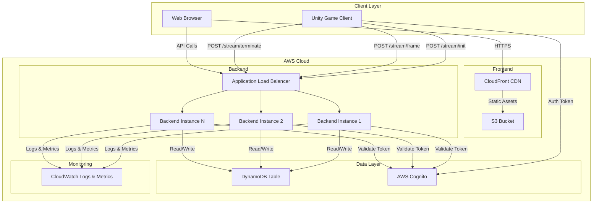

# Design Document: Streaming Web Platform

## Overview

The streaming web platform is a full-stack web application that enables Unity game players to broadcast their gameplay and allows viewers to watch these streams in real-time. The system consists of three main components:

1. **Frontend Web Application**: A React-based single-page application that displays the list of active streamers and provides video playback functionality
2. **Backend API Service**: A Node.js/Express REST API that manages streaming sessions, processes frame data, and interfaces with AWS services
3. **AWS Infrastructure**: DynamoDB for data persistence, S3/CloudFront for frontend hosting, and Elastic Beanstalk or Lambda for backend hosting

The platform follows a polling-based architecture where the frontend periodically fetches the latest frame data from the backend, which maintains the most recent frame in memory for each active session. DynamoDB stores session metadata and state information, while the actual frame data is transmitted through the API without persistent storage to optimize for real-time performance.

### Key Design Decisions

- **Polling vs WebSockets**: We use HTTP polling instead of WebSockets to simplify deployment on AWS Lambda and reduce connection management complexity. The 33ms polling interval provides acceptable latency for 30 FPS streaming.
- **In-Memory Frame Storage**: The backend stores only the latest frame per session in memory rather than persisting frames to S3 or DynamoDB, optimizing for low latency at the cost of frame history.
- **Stateless Backend**: The backend is designed to be stateless (except for in-memory frame cache) to enable horizontal scaling across multiple instances.
- **DynamoDB Single Table Design**: All streaming session data is stored in a single DynamoDB table with appropriate indexes for efficient querying.

## Architecture

### System Architecture Diagram



### Data Flow

#### Streaming Session Initialization
1. Unity game client authenticates with AWS Cognito and obtains JWT token
2. Client sends POST request to `/stream/init` with token and session metadata
3. Backend validates token with Cognito
4. Backend creates new session record in DynamoDB with Session_ID, Player_ID, and metadata
5. Backend returns Session_ID to client
6. Backend logs initialization event to CloudWatch

#### Frame Streaming
1. Unity client captures frame and encodes as base64 JPEG
2. Client sends POST request to `/stream/frame` with Session_ID, frame data, and game state metadata
3. Backend validates Session_ID exists in DynamoDB
4. Backend stores frame in in-memory cache (Map<Session_ID, FrameData>)
5. Backend updates session's last_frame_timestamp in DynamoDB
6. Backend returns success response
7. Backend emits frame processing metric to CloudWatch

#### Viewer Experience
1. Frontend loads and fetches active sessions from `/stream/active`
2. Backend queries DynamoDB for sessions with status='active' and last_frame_timestamp within last 10 seconds
3. Frontend displays list of active streamers
4. User selects a streamer
5. Frontend starts polling `/stream/frame/:sessionId` every 33ms
6. Backend retrieves latest frame from in-memory cache
7. Frontend decodes base64 frame and renders to canvas
8. Frontend extracts and displays game state metadata

### Deployment Architecture

**Frontend Deployment:**
- React application built to static assets (HTML, CSS, JS)
- Uploaded to S3 bucket with static website hosting enabled
- CloudFront distribution configured with S3 as origin
- CloudFront provides HTTPS, caching, and global CDN distribution

**Backend Deployment (Option 1 - Elastic Beanstalk):**
- Node.js application packaged with dependencies
- Deployed to Elastic Beanstalk environment with Node.js platform
- Auto-scaling group with minimum 2 instances for high availability
- Application Load Balancer distributes traffic across instances
- Environment variables configure AWS region, DynamoDB table name, Cognito pool ID

**Backend Deployment (Option 2 - Lambda + API Gateway):**
- Node.js application packaged as Lambda function
- API Gateway provides REST API endpoints
- Lambda provisioned concurrency for consistent performance
- API Gateway handles CORS and request validation
- Note: In-memory frame cache requires sticky sessions or external cache (Redis/ElastiCache)

**Recommended Approach:** Elastic Beanstalk for simpler in-memory frame caching without additional infrastructure.

## Components and Interfaces

### Frontend Components

#### StreamerList Component
**Responsibility:** Display list of active streaming sessions

**Props:**
- None (fetches data internally)

**State:**
- `streamers: Array<StreamerInfo>` - List of active streamers
- `loading: boolean` - Loading state indicator
- `error: string | null` - Error message if fetch fails

**Behavior:**
- Fetches active streamers from `/stream/active` on mount
- Refreshes list every 5 seconds using setInterval
- Filters out sessions with last_frame_timestamp older than 10 seconds
- Displays "No active streams" message when list is empty
- Handles fetch errors with retry logic (5 second delay)

**Interface:**
```typescript
interface StreamerInfo {
  sessionId: string;
  playerId: string;
  startTime: string; // ISO 8601 timestamp
  gameVersion: string;
  lastFrameTime: string; // ISO 8601 timestamp
  currentWave?: number;
  enemyCount?: number;
  towerCount?: number;
  health?: number;
  score?: number;
}
```

#### VideoPlayer Component
**Responsibility:** Display streaming video and game state for selected session

**Props:**
- `sessionId: string` - The session to display

**State:**
- `currentFrame: string | null` - Base64 encoded JPEG frame
- `gameState: GameState` - Current game state metadata
- `connectionStatus: 'connected' | 'disconnected' | 'error'`
- `lastFrameTime: number` - Timestamp of last received frame

**Behavior:**
- Polls `/stream/frame/:sessionId` every 33ms using setInterval
- Decodes base64 frame data and renders to canvas element
- Extracts game state metadata from frame response
- Monitors frame timestamps and shows "connection lost" if no frames for 10 seconds
- Cleans up polling interval on unmount

**Interface:**
```typescript
interface GameState {
  wave: number;
  enemyCount: number;
  towerCount: number;
  health: number;
  score: number;
}

interface FrameResponse {
  sessionId: string;
  frameData: string; // base64 encoded JPEG
  timestamp: string; // ISO 8601
  gameState: GameState;
}
```

#### App Component
**Responsibility:** Root component managing application state and routing

**State:**
- `selectedSessionId: string | null` - Currently selected session for viewing

**Behavior:**
- Renders StreamerList component
- Renders VideoPlayer component when session is selected
- Handles session selection from StreamerList
- Provides error boundary for child components

### Backend Components

#### Express Application (app.js)
**Responsibility:** Configure Express server, middleware, and routes

**Configuration:**
- CORS middleware with CloudFront origin whitelist
- JSON body parser with 10MB limit (for base64 frames)
- Request logging middleware
- Error handling middleware
- Health check endpoint at `/health`

#### Session Controller (controllers/sessionController.js)
**Responsibility:** Handle streaming session lifecycle endpoints

**Methods:**

`initializeSession(req, res)`
- Validates authentication token with Cognito
- Extracts Player_ID from token claims
- Generates unique Session_ID (UUID v4)
- Creates session record in DynamoDB
- Returns Session_ID to client
- Logs initialization event

`terminateSession(req, res)`
- Validates authentication token
- Verifies session belongs to authenticated player
- Updates session record with end timestamp and final statistics
- Removes frame from in-memory cache
- Logs termination event

`getActiveSessions(req, res)`
- Queries DynamoDB for sessions with status='active'
- Filters sessions with last_frame_timestamp within last 10 seconds
- Returns array of session metadata
- No authentication required (public endpoint)

#### Frame Controller (controllers/frameController.js)
**Responsibility:** Handle frame upload and retrieval

**Methods:**

`uploadFrame(req, res)`
- Validates Session_ID exists in DynamoDB
- Validates frame data format (base64 JPEG)
- Stores frame in in-memory cache (frameCache Map)
- Updates session's last_frame_timestamp in DynamoDB
- Emits CloudWatch metric for frame processing
- Returns success response

`getLatestFrame(req, res)`
- Retrieves Session_ID from URL parameter
- Looks up frame in in-memory cache
- Returns frame data with game state metadata
- Returns 404 if session not found or no frame available
- No authentication required (public endpoint)

**Frame Cache Structure:**
```javascript
// In-memory Map
const frameCache = new Map();

// Cache entry structure
{
  sessionId: string,
  frameData: string, // base64 JPEG
  timestamp: Date,
  gameState: {
    wave: number,
    enemyCount: number,
    towerCount: number,
    health: number,
    score: number
  }
}
```

#### DynamoDB Service (services/dynamodbService.js)
**Responsibility:** Encapsulate all DynamoDB operations

**Methods:**

`createSession(sessionData)`
- Puts new item in StreamingSessions table
- Sets TTL attribute to current time + 7 days
- Returns created session object

`updateSessionTimestamp(sessionId, timestamp)`
- Updates last_frame_timestamp attribute
- Uses UpdateItem operation for efficiency

`updateSessionEnd(sessionId, endData)`
- Updates end_timestamp, final statistics, and status='completed'
- Uses UpdateItem operation

`getSession(sessionId)`
- Retrieves session by Session_ID (partition key)
- Returns session object or null

`getActiveSessions()`
- Queries table with GSI on status attribute
- Filters by last_frame_timestamp > (now - 10 seconds)
- Returns array of active sessions

`deleteExpiredSessions()`
- DynamoDB TTL handles automatic deletion
- No manual cleanup required

#### Cognito Service (services/cognitoService.js)
**Responsibility:** Handle authentication token validation

**Methods:**

`validateToken(token)`
- Verifies JWT signature using Cognito public keys
- Validates token expiration
- Validates token issuer matches Cognito User Pool
- Returns decoded token claims including Player_ID
- Throws error if validation fails

#### CloudWatch Service (services/cloudwatchService.js)
**Responsibility:** Emit logs and custom metrics

**Methods:**

`logEvent(level, message, context)`
- Writes structured log to CloudWatch Logs
- Includes timestamp, level, message, and context object

`emitMetric(metricName, value, unit)`
- Puts custom metric to CloudWatch
- Namespace: 'StreamingPlatform'
- Dimensions: Environment, Region

**Custom Metrics:**
- `ActiveSessionCount` - Number of active streaming sessions
- `FrameProcessingTime` - Time to process frame upload (milliseconds)
- `FrameUploadRate` - Number of frames uploaded per minute
- `APIRequestCount` - Number of API requests by endpoint
- `APIErrorRate` - Number of failed API requests

### API Endpoints

#### POST /stream/init
**Purpose:** Initialize new streaming session

**Authentication:** Required (Cognito JWT token in Authorization header)

**Request Body:**
```json
{
  "gameVersion": "1.0.0",
  "streamingConfig": {
    "resolution": "1920x1080",
    "frameRate": 30,
    "quality": 85
  }
}
```

**Response (201 Created):**
```json
{
  "sessionId": "550e8400-e29b-41d4-a716-446655440000",
  "playerId": "player123",
  "startTime": "2024-01-15T10:30:00Z"
}
```

**Error Responses:**
- 401 Unauthorized - Invalid or expired token
- 400 Bad Request - Invalid request body
- 503 Service Unavailable - DynamoDB connection error

#### POST /stream/frame
**Purpose:** Upload frame data for active session

**Authentication:** Not required (session validation via Session_ID)

**Request Body:**
```json
{
  "sessionId": "550e8400-e29b-41d4-a716-446655440000",
  "frameData": "base64_encoded_jpeg_string...",
  "timestamp": "2024-01-15T10:30:05.123Z",
  "gameState": {
    "wave": 5,
    "enemyCount": 12,
    "towerCount": 8,
    "health": 85,
    "score": 1250
  }
}
```

**Response (200 OK):**
```json
{
  "success": true,
  "sessionId": "550e8400-e29b-41d4-a716-446655440000"
}
```

**Error Responses:**
- 404 Not Found - Session_ID does not exist
- 400 Bad Request - Invalid frame data or missing required fields
- 503 Service Unavailable - DynamoDB connection error

#### POST /stream/terminate
**Purpose:** Terminate active streaming session

**Authentication:** Required (Cognito JWT token)

**Request Body:**
```json
{
  "sessionId": "550e8400-e29b-41d4-a716-446655440000",
  "finalStats": {
    "totalWaves": 10,
    "finalScore": 2500,
    "totalFrames": 18000
  }
}
```

**Response (200 OK):**
```json
{
  "success": true,
  "sessionId": "550e8400-e29b-41d4-a716-446655440000",
  "endTime": "2024-01-15T11:00:00Z"
}
```

**Error Responses:**
- 401 Unauthorized - Invalid token or session doesn't belong to player
- 404 Not Found - Session_ID does not exist
- 503 Service Unavailable - DynamoDB connection error

#### GET /stream/active
**Purpose:** Retrieve list of active streaming sessions

**Authentication:** Not required (public endpoint)

**Query Parameters:** None

**Response (200 OK):**
```json
{
  "sessions": [
    {
      "sessionId": "550e8400-e29b-41d4-a716-446655440000",
      "playerId": "player123",
      "startTime": "2024-01-15T10:30:00Z",
      "gameVersion": "1.0.0",
      "lastFrameTime": "2024-01-15T10:35:42Z",
      "currentGameState": {
        "wave": 5,
        "enemyCount": 12,
        "towerCount": 8,
        "health": 85,
        "score": 1250
      }
    }
  ]
}
```

**Error Responses:**
- 503 Service Unavailable - DynamoDB connection error

#### GET /stream/frame/:sessionId
**Purpose:** Retrieve latest frame for specific session

**Authentication:** Not required (public endpoint)

**URL Parameters:**
- `sessionId` - The session ID to retrieve frame for

**Response (200 OK):**
```json
{
  "sessionId": "550e8400-e29b-41d4-a716-446655440000",
  "frameData": "base64_encoded_jpeg_string...",
  "timestamp": "2024-01-15T10:35:42.456Z",
  "gameState": {
    "wave": 5,
    "enemyCount": 12,
    "towerCount": 8,
    "health": 85,
    "score": 1250
  }
}
```

**Error Responses:**
- 404 Not Found - Session not found or no frame available
- 503 Service Unavailable - Cache retrieval error

## Data Models

### DynamoDB Table: StreamingSessions

**Table Configuration:**
- Table Name: `StreamingSessions`
- Billing Mode: On-Demand (PAY_PER_REQUEST)
- Partition Key: `sessionId` (String)
- TTL Attribute: `ttl` (Number, Unix timestamp)

**Global Secondary Index: StatusIndex**
- Partition Key: `status` (String)
- Sort Key: `lastFrameTimestamp` (Number, Unix timestamp)
- Projection: ALL
- Purpose: Efficiently query active sessions

**Item Schema:**
```json
{
  "sessionId": "550e8400-e29b-41d4-a716-446655440000",
  "playerId": "player123",
  "status": "active",
  "startTimestamp": 1705315800,
  "endTimestamp": 1705317600,
  "lastFrameTimestamp": 1705316142,
  "gameVersion": "1.0.0",
  "streamingConfig": {
    "resolution": "1920x1080",
    "frameRate": 30,
    "quality": 85
  },
  "finalStats": {
    "totalWaves": 10,
    "finalScore": 2500,
    "totalFrames": 18000
  },
  "ttl": 1705920600
}
```

**Attribute Descriptions:**
- `sessionId` (String, PK): Unique identifier for session (UUID v4)
- `playerId` (String): Player identifier from Cognito token
- `status` (String): Session status - 'active' or 'completed'
- `startTimestamp` (Number): Unix timestamp when session started
- `endTimestamp` (Number): Unix timestamp when session ended (null if active)
- `lastFrameTimestamp` (Number): Unix timestamp of most recent frame
- `gameVersion` (String): Version of Unity game client
- `streamingConfig` (Map): Configuration parameters for streaming
- `finalStats` (Map): Final statistics when session terminates
- `ttl` (Number): Unix timestamp for automatic deletion (7 days after start)

**Access Patterns:**
1. Get session by sessionId: `GetItem` on partition key
2. Get all active sessions: `Query` on StatusIndex where status='active'
3. Update last frame timestamp: `UpdateItem` on sessionId
4. Create new session: `PutItem`
5. Mark session completed: `UpdateItem` on sessionId

### AWS Cognito User Pool

**Configuration:**
- User Pool Name: `StreamingPlatformUsers`
- Sign-in Options: Username, Email
- Password Policy: Minimum 8 characters, require uppercase, lowercase, numbers
- MFA: Optional
- Token Expiration: Access token 1 hour, Refresh token 30 days

**User Attributes:**
- `sub` (UUID): Cognito user ID, used as Player_ID
- `email`: User email address
- `username`: Display name for streamer

**App Client:**
- Client Name: `UnityGameClient`
- Auth Flows: USER_PASSWORD_AUTH, REFRESH_TOKEN_AUTH
- Token Validation: Backend validates JWT signature and expiration

### In-Memory Frame Cache

**Structure:**
```javascript
// Map<sessionId, FrameData>
const frameCache = new Map();

// FrameData structure
{
  sessionId: string,
  frameData: string, // base64 encoded JPEG
  timestamp: Date,
  gameState: {
    wave: number,
    enemyCount: number,
    towerCount: number,
    health: number,
    score: number
  }
}
```

**Cache Management:**
- Maximum size: 1000 entries (supports 100 concurrent streams with buffer)
- Eviction policy: LRU (Least Recently Used)
- Entry lifetime: Removed when session terminates or after 60 seconds of inactivity
- Memory estimate: ~500KB per entry (assuming 400KB JPEG), ~500MB total

**Cache Operations:**
- `set(sessionId, frameData)`: Store or update frame for session
- `get(sessionId)`: Retrieve latest frame for session
- `delete(sessionId)`: Remove frame when session terminates
- `cleanup()`: Periodic cleanup of stale entries (runs every 60 seconds)


## Correctness Properties

*A property is a characteristic or behavior that should hold true across all valid executions of a system—essentially, a formal statement about what the system should do. Properties serve as the bridge between human-readable specifications and machine-verifiable correctness guarantees.*

### Property 1: Streamer Display Completeness

*For any* active streamer returned by the backend, the frontend display should include Player_ID, current game state, and session start time.

**Validates: Requirements 1.2**

### Property 2: Inactive Session Removal

*For any* streaming session that becomes inactive (no frames for 10+ seconds), the frontend should remove it from the displayed list within 10 seconds of becoming inactive.

**Validates: Requirements 1.3**

### Property 3: Session Creation Completeness

*For any* valid session initialization request, the created DynamoDB record should include Session_ID, Player_ID, start timestamp, game version, streaming configuration, and TTL attribute set to 7 days from creation.

**Validates: Requirements 2.1, 2.2, 2.5**

### Property 4: Frame Upload Updates Session

*For any* valid frame upload to an active session, the session's last_frame_timestamp in DynamoDB should be updated to match the frame timestamp.

**Validates: Requirements 2.3**

### Property 5: Session Termination Updates Record

*For any* session termination request, the DynamoDB record should be updated with end_timestamp and final statistics, and the status should change to 'completed'.

**Validates: Requirements 2.4**

### Property 6: Video Player Display on Selection

*For any* streamer selected from the list, the frontend should display the video player component with the corresponding Session_ID.

**Validates: Requirements 3.1**

### Property 7: Frame Retrieval Returns Latest

*For any* session with uploaded frames, requesting the latest frame should return the most recently uploaded frame for that Session_ID.

**Validates: Requirements 3.3**

### Property 8: Frame Encoding Round Trip

*For any* valid JPEG image encoded as base64, the frontend decoding process should produce an image that can be rendered without errors.

**Validates: Requirements 3.4**

### Property 9: Game State Metadata Extraction

*For any* frame response containing game state, the frontend should extract and display all five metadata fields: wave number, enemy count, tower count, health, and score.

**Validates: Requirements 4.1, 4.2, 4.3, 4.4, 4.5**

### Property 10: Request Validation Returns Correct Status

*For any* API request with invalid payload structure, the backend should return HTTP 400 Bad Request; for any request with valid payload, the backend should return a 2xx success status or appropriate error status (401, 404, 503).

**Validates: Requirements 5.6**

### Property 11: CORS Headers Present

*For any* API response from the backend, the response should include appropriate CORS headers allowing access from the CloudFront domain.

**Validates: Requirements 6.5**

### Property 12: Authentication Token Validation

*For any* session initialization request, the backend should validate the authentication token before processing the request.

**Validates: Requirements 7.1**

### Property 13: Invalid Token Returns 401

*For any* session initialization or termination request with an invalid or expired authentication token, the backend should return HTTP 401 Unauthorized.

**Validates: Requirements 7.3**

### Property 14: Player ID Extraction

*For any* valid authentication token, the backend should successfully extract the Player_ID from the token claims and use it in the session record.

**Validates: Requirements 7.4**

### Property 15: Polling Continues After Failure

*For any* frame request that fails, the frontend should continue polling for frames without disrupting the user interface or stopping the polling interval.

**Validates: Requirements 8.3**

### Property 16: Malformed Data Returns 400

*For any* frame upload request with malformed frame data (invalid base64, missing required fields), the backend should log the error and return HTTP 400 Bad Request.

**Validates: Requirements 8.4**

### Property 17: Streaming Operations Logged with Context

*For any* session initialization, termination, or error event, the backend should create a log entry that includes Session_ID and Player_ID (when available).

**Validates: Requirements 10.1, 10.4**

### Property 18: Metrics Emitted for Operations

*For any* frame upload operation, the backend should emit custom CloudWatch metrics for frame processing time and frame upload rate.

**Validates: Requirements 10.2**

### Property 19: Error Logging Includes Stack Trace

*For any* error that occurs in the backend, the log entry should include the error message, stack trace, and request context.

**Validates: Requirements 10.3**

### Property 20: Frontend Error Logging

*For any* JavaScript error that occurs in the frontend, the error should be logged to the browser console with error message and stack trace.

**Validates: Requirements 10.5**

## Error Handling

### Frontend Error Handling

**Network Errors:**
- When API requests fail due to network issues, display user-friendly error message
- Implement exponential backoff for retries (5s, 10s, 20s)
- Maintain UI state during network failures (don't clear displayed data)
- Show connection status indicator (connected/disconnected/reconnecting)

**Frame Loading Errors:**
- If frame decoding fails, log error to console but continue polling
- Display last successfully decoded frame until new frame arrives
- Show "buffering" indicator if frames are delayed
- After 10 seconds without frames, show "connection lost" message

**Invalid Data Errors:**
- Validate API response structure before processing
- Handle missing or null fields gracefully with default values
- Log validation errors to console for debugging
- Display generic error message to user without exposing technical details

**Component Errors:**
- Implement React Error Boundaries around major components
- Catch and log rendering errors
- Display fallback UI when component crashes
- Provide "reload" button to recover from error state

### Backend Error Handling

**DynamoDB Errors:**
- Catch `ResourceNotFoundException` and return 404 Not Found
- Catch `ProvisionedThroughputExceededException` and return 503 Service Unavailable
- Catch `ValidationException` and return 400 Bad Request
- Implement retry logic with exponential backoff for transient errors
- Log all DynamoDB errors with operation context

**Authentication Errors:**
- Catch `TokenExpiredError` and return 401 Unauthorized with message "Token expired"
- Catch `JsonWebTokenError` and return 401 Unauthorized with message "Invalid token"
- Catch `NotBeforeError` and return 401 Unauthorized with message "Token not yet valid"
- Log authentication failures with attempted Player_ID (if extractable)

**Validation Errors:**
- Validate request body against JSON schema
- Return 400 Bad Request with specific validation error messages
- Validate Session_ID format (UUID v4)
- Validate base64 frame data format
- Validate game state values are within reasonable ranges

**Timeout Errors:**
- Set 30 second timeout for all DynamoDB operations
- Return 503 Service Unavailable if timeout occurs
- Log timeout errors with operation details
- Implement circuit breaker pattern for repeated timeouts

**Memory Errors:**
- Monitor frame cache size and implement LRU eviction
- Reject frame uploads if cache is full (return 503)
- Log memory usage metrics to CloudWatch
- Implement graceful degradation if memory pressure detected

**Unexpected Errors:**
- Catch all unhandled errors in Express error middleware
- Return 500 Internal Server Error with generic message
- Log full error details including stack trace
- Emit error metric to CloudWatch
- Never expose internal error details to client

### Error Response Format

All error responses follow consistent JSON structure:

```json
{
  "error": {
    "code": "ERROR_CODE",
    "message": "Human-readable error message",
    "details": {
      "field": "Additional context (optional)"
    }
  }
}
```

**Error Codes:**
- `INVALID_TOKEN` - Authentication token is invalid or expired
- `SESSION_NOT_FOUND` - Requested session does not exist
- `INVALID_REQUEST` - Request payload validation failed
- `SERVICE_UNAVAILABLE` - Backend service or DynamoDB unavailable
- `MALFORMED_FRAME` - Frame data is not valid base64 JPEG
- `UNAUTHORIZED` - User not authorized for requested operation
- `INTERNAL_ERROR` - Unexpected server error occurred

## Testing Strategy

### Overview

The testing strategy employs a dual approach combining unit tests for specific examples and edge cases with property-based tests for universal correctness properties. This ensures both concrete behavior validation and comprehensive input coverage.

### Unit Testing

**Frontend Unit Tests (Jest + React Testing Library):**
- Component rendering with specific props
- User interaction handlers (click, select)
- API call mocking and response handling
- Error boundary behavior
- Edge cases: empty lists, null data, loading states
- Specific timing behaviors (5 second refresh, 33ms polling)

**Backend Unit Tests (Jest + Supertest):**
- API endpoint existence and routing
- Request validation with specific invalid payloads
- Authentication middleware with specific tokens
- DynamoDB service methods with mocked AWS SDK
- Error handling with specific error conditions
- Edge cases: empty sessions, expired tokens, missing fields

**Example Unit Tests:**
- Frontend loads and fetches active sessions on mount (Req 1.1)
- Frontend refreshes list every 5 seconds (Req 1.4)
- Frontend shows "no streams" message when list empty (Req 1.5)
- Frontend polls frames every 33ms (Req 3.2)
- Frontend shows "connection lost" after 10 second timeout (Req 3.5)
- Backend provides all required endpoints (Req 5.1-5.5)
- Backend reads AWS region from environment variable (Req 6.4)
- Backend allows unauthenticated access to public endpoints (Req 7.5)
- Backend returns 503 when DynamoDB unavailable (Req 8.1)
- Frontend retries after connection error (Req 8.2)
- Backend enforces 30 second timeout (Req 8.5)

### Property-Based Testing

**Testing Library:** 
- Frontend: `fast-check` (JavaScript property-based testing)
- Backend: `fast-check` (JavaScript property-based testing)

**Configuration:**
- Minimum 100 iterations per property test
- Each test tagged with comment: `// Feature: streaming-web-platform, Property N: [property text]`
- Custom generators for domain objects (sessions, frames, tokens)

**Property Test Implementation:**

Each correctness property from the design document should be implemented as a property-based test. The tests should:

1. Generate random valid inputs using fast-check arbitraries
2. Execute the system behavior
3. Assert the property holds for all generated inputs
4. Reference the design document property in a comment

**Example Property Test Structure:**

```javascript
// Feature: streaming-web-platform, Property 3: Session Creation Completeness
test('created sessions include all required fields', () => {
  fc.assert(
    fc.property(
      sessionInitRequestArbitrary(),
      async (initRequest) => {
        const session = await createSession(initRequest);
        
        expect(session).toHaveProperty('sessionId');
        expect(session).toHaveProperty('playerId');
        expect(session).toHaveProperty('startTimestamp');
        expect(session).toHaveProperty('gameVersion');
        expect(session).toHaveProperty('streamingConfig');
        expect(session.ttl).toBeGreaterThan(Date.now() / 1000 + 6 * 24 * 60 * 60);
      }
    ),
    { numRuns: 100 }
  );
});
```

**Custom Generators (Arbitraries):**

```javascript
// Session initialization request generator
const sessionInitRequestArbitrary = () => fc.record({
  gameVersion: fc.string({ minLength: 1, maxLength: 20 }),
  streamingConfig: fc.record({
    resolution: fc.constantFrom('1920x1080', '1280x720', '3840x2160'),
    frameRate: fc.integer({ min: 15, max: 60 }),
    quality: fc.integer({ min: 50, max: 100 })
  })
});

// Frame data generator
const frameDataArbitrary = () => fc.record({
  sessionId: fc.uuid(),
  frameData: fc.base64String({ minLength: 1000, maxLength: 500000 }),
  timestamp: fc.date().map(d => d.toISOString()),
  gameState: fc.record({
    wave: fc.integer({ min: 1, max: 100 }),
    enemyCount: fc.integer({ min: 0, max: 200 }),
    towerCount: fc.integer({ min: 0, max: 50 }),
    health: fc.integer({ min: 0, max: 100 }),
    score: fc.integer({ min: 0, max: 1000000 })
  })
});

// Authentication token generator (valid JWT structure)
const validTokenArbitrary = () => fc.record({
  sub: fc.uuid(),
  email: fc.emailAddress(),
  username: fc.string({ minLength: 3, maxLength: 20 }),
  exp: fc.integer({ min: Math.floor(Date.now() / 1000) + 3600 })
}).map(claims => generateJWT(claims));

// Invalid token generator
const invalidTokenArbitrary = () => fc.oneof(
  fc.string(), // Random string
  fc.constant(''), // Empty string
  fc.constant('Bearer invalid.token.here'), // Malformed JWT
  validTokenArbitrary().map(token => token + 'corrupted') // Corrupted valid token
);
```

**Property Tests to Implement:**

1. Property 1: Streamer Display Completeness - Generate random streamers, verify all fields displayed
2. Property 2: Inactive Session Removal - Generate sessions, mark inactive, verify removal timing
3. Property 3: Session Creation Completeness - Generate init requests, verify all fields in DB
4. Property 4: Frame Upload Updates Session - Generate frames, verify timestamp updates
5. Property 5: Session Termination Updates Record - Generate sessions, terminate, verify updates
6. Property 6: Video Player Display - Generate session selections, verify player shown
7. Property 7: Frame Retrieval Returns Latest - Generate multiple frames, verify latest returned
8. Property 8: Frame Encoding Round Trip - Generate images, encode/decode, verify integrity
9. Property 9: Game State Metadata Extraction - Generate frames, verify all metadata extracted
10. Property 10: Request Validation - Generate valid/invalid requests, verify status codes
11. Property 11: CORS Headers Present - Generate requests, verify CORS headers in responses
12. Property 12: Authentication Token Validation - Generate requests, verify validation occurs
13. Property 13: Invalid Token Returns 401 - Generate invalid tokens, verify 401 response
14. Property 14: Player ID Extraction - Generate valid tokens, verify Player_ID extracted
15. Property 15: Polling Continues After Failure - Generate failures, verify polling continues
16. Property 16: Malformed Data Returns 400 - Generate malformed data, verify 400 response
17. Property 17: Streaming Operations Logged - Generate operations, verify log entries
18. Property 18: Metrics Emitted - Generate operations, verify metrics emitted
19. Property 19: Error Logging Includes Stack Trace - Generate errors, verify log format
20. Property 20: Frontend Error Logging - Generate JS errors, verify console logging

### Integration Testing

**API Integration Tests:**
- Full request/response cycle through Express app
- Real DynamoDB Local instance for database operations
- Mock Cognito service for authentication
- Test complete workflows: init → frame upload → retrieval → terminate
- Test error scenarios with real error responses

**End-to-End Tests (Cypress):**
- Load frontend in browser
- Mock backend API responses
- Test complete user flows: view list → select streamer → watch stream
- Test error handling: network failures, timeouts, invalid data
- Test UI responsiveness and updates

### Test Coverage Goals

- Unit test coverage: >80% line coverage
- Property test coverage: All 20 correctness properties implemented
- Integration test coverage: All API endpoints and workflows
- E2E test coverage: All critical user paths

### Continuous Integration

- Run all tests on every commit
- Run property tests with 100 iterations in CI
- Run integration tests against DynamoDB Local
- Generate coverage reports
- Fail build if coverage drops below threshold
- Run E2E tests on staging environment before production deployment

